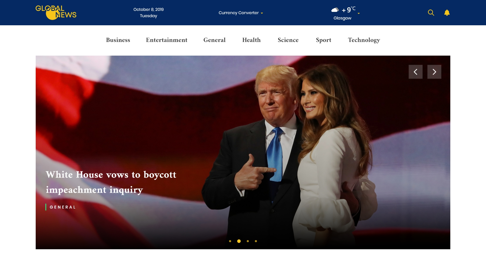

# Global News

## A news website enabling people to be kept up-to-date on world events

### Introduction

Global News is a pattern of a single-page news website which is built on Vue.js. The website consists of the home page, seven thematic categories, currency converter, and weather. Basing on a user geolocation, it displays the current date and weather details.

### Screen Cast

### Usage

The website uses free APIs to display the most popular news on the home page and upload articles in accordance with every category specialisation as well as users’ search requests. They also allow making conversions of required currencies and showing the weather data.

To determine geolocation and provide users with actual maps we have integrated Mapbox Maps to the website. Global News includes news subscription for all articles or a specific category so that users can receive daily news reports on their emails.

### Key Features:

- Interactive UX
- News subscription
- Sharing in Facebook, Twitter, and LinkedIn
- Mapbox Maps integration
- Geolocation determination
- Weather information
- Currency converter
- Search requests

### Keep in Touch With Us

We would be glad to see your case of use of our pattern and receive any suggestions. You can share your example of a news website using the pattern or ask any questions regarding Global News by the email info@anuitex.com.

Please, feel free to make a pull request or issue. We are open to contribute your bright ideas and improve the project together with you.

### License

Global News is under the MIT License.
